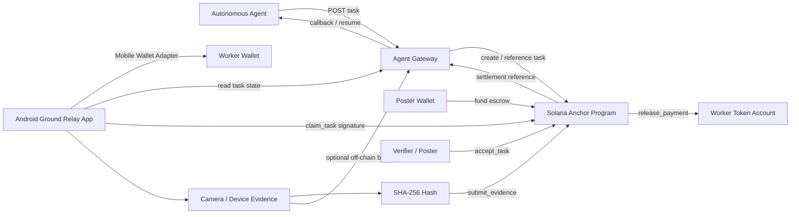
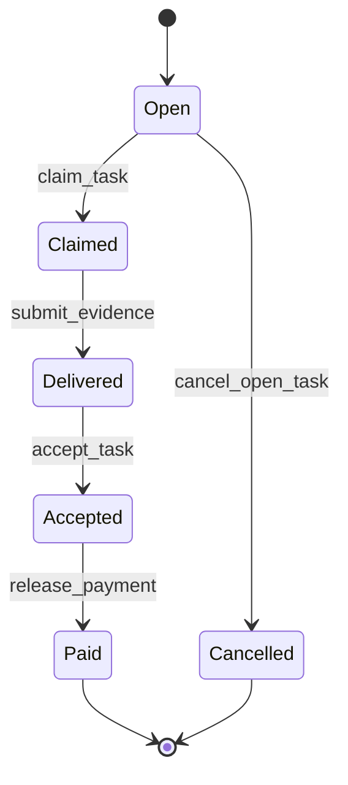

# Ground Relay — Product Anatomy & Operating Model

> **Purpose of this document:** give evaluators, contributors, and reviewers a transparent, end-to-end explanation of what Ground Relay is, why it exists, how its components connect, what is already proven, what is still being integrated, where data and money move, and what real-world problems the system is intended to solve.

**Project:** Ground Relay  
**Hackathon:** CLOCK IN — Solana Mobile  
**Network during development:** Solana devnet  
**Current controlled program ID:** `6v2peeoZVj2AXfczVLqyMUTHYt3XQPqAxCktpTwjUZap`  
**Status source of truth:** [Current checkpoint](checkpoints/CURRENT.md)  
**Execution plan:** [Roadmap](roadmap.md)

---

## 1. Executive summary

Ground Relay is a **human-in-the-loop execution layer for autonomous agents**.

Autonomous software can browse, reason, call APIs, write code, move data, and coordinate digital workflows. It still fails when a task requires a trusted human with a phone, a wallet, physical presence, camera access, local context, or a judgment that cannot be completed safely or credibly by software alone.

Ground Relay turns that human-only blocker into a structured, paid task.

The intended product loop is:

`agent blocked -> funded task -> worker claims -> real-world action -> evidence -> verification -> escrow payout -> agent resumes`

The product is not trying to make humans replace agents. It is designed to let agents **escalate the narrow part they cannot complete**, obtain a verifiable result, pay for successful execution, and continue automatically.

The core design combines:

- an **agent-facing gateway** for task creation and status;
- a **Solana Anchor program** for task state and escrow settlement;
- an **Android worker app** using Solana Mobile Wallet Adapter;
- **camera/evidence capture** with content hashing;
- a **verification step** before payout;
- a **callback/resume path** back to the originating agent.

---

## 2. The problem Ground Relay solves

An autonomous agent can be highly capable and still encounter a hard boundary.

Examples:

- “Confirm that this storefront is open and the sign matches the expected business.”
- “Photograph the serial number on an authorized machine in this facility.”
- “Check whether a parcel is actually present in a building mailroom.”
- “Confirm that an accessibility entrance is usable right now.”
- “Inspect a shelf or display that has no live API or camera feed.”
- “Perform a phone-local action that requires a human wallet signature.”
- “Verify a real-world condition before an automated workflow continues.”

Without a human escalation path, the agent has only poor options: guess, stop, ask the owner to manually coordinate someone, or rely on an unverifiable message.

Ground Relay gives the workflow a formal handoff:

1. Define exactly what the human must do.
2. Fund the reward before work begins.
3. Let a worker explicitly claim the task.
4. Capture evidence through the mobile device.
5. Commit the evidence hash and task state.
6. Accept or reject the result.
7. Release payment only after acceptance.
8. Notify the agent so the original workflow can continue.

This turns an ad-hoc interruption into a repeatable execution primitive.

---

## 3. What Ground Relay is — and is not

### Ground Relay is

- a mobile-first human escalation system for autonomous agents;
- a structured microtask protocol;
- a worker identity and signing flow through a Solana wallet;
- an escrow-backed settlement model;
- an evidence commitment system;
- a bridge between digital automation and authorized real-world execution.

### Ground Relay is not

- a system for storing private photos permanently on-chain;
- a requirement that workers deposit or stake capital before participating;
- a hidden surveillance network;
- an automatic claim that any submitted photo is true;
- a production/mainnet financial product in its current hackathon state;
- a replacement for legal, safety, access-control, or consent requirements.

Tasks should be lawful, explicitly authorized, and scoped so a worker can complete them without trespass, deception, unsafe behavior, or unnecessary collection of personal information.

---

## 4. The actors

Ground Relay separates responsibilities instead of giving one party total control.

| Actor | Role | What it controls |
| --- | --- | --- |
| **Originating agent** | Detects a human-only blocker and requests execution | Task intent, criteria, callback context |
| **Poster** | Economic owner of the task | Reward, expiry, acceptance/cancellation authority |
| **Worker** | Human using the Android app | Wallet signature, physical/device action, evidence capture |
| **Verifier** | Determines whether criteria were satisfied | Acceptance/rejection decision |
| **Anchor program** | Enforces task state and token movement | Escrow rules, worker assignment, settlement transitions |
| **Agent Gateway** | Coordinates off-chain workflow data | API task representation, delivery metadata, callback/resume |
| **Solana wallet** | Protects user signing authority | Worker/poster private keys stay inside wallet control |
| **Evidence storage/location** | Holds full evidence object if retained | Off-chain image/video/text; only hashes need to be on-chain |

The same person or system may occupy more than one role in a demo, but the architecture keeps the roles conceptually separate.

---

## 5. System anatomy



At a high level, there are **three planes**:

### Execution plane

The Android app and the human worker perform the action that the agent cannot.

### Settlement plane

The Solana program records task state and controls escrowed tokens.

### Coordination plane

The Agent Gateway carries task descriptions, criteria, evidence references, and the callback that resumes the originating agent.

Keeping these planes separate is intentional. A photograph does not need to be stored on-chain just because the payment is settled on-chain.

---

## 6. Component anatomy

### 6.1 Originating agent

The originating agent is any autonomous workflow that can detect:

> “I cannot safely or credibly complete the next step without a human.”

It prepares a task containing:

- a clear title and description;
- explicit acceptance criteria;
- reward amount and mint;
- expiration;
- optional callback URL or continuation reference.

The agent should not encode vague instructions such as “check this.” A good Ground Relay task is testable: a verifier should be able to decide whether it was completed.

---

### 6.2 Agent Gateway

The gateway is the off-chain coordination layer.

Current project API shape includes operations equivalent to:

- `POST /v1/tasks` — create a task;
- `GET /v1/tasks/:id` — read current state;
- `POST /v1/tasks/:id/claim` — mirror worker claim metadata;
- `POST /v1/tasks/:id/deliveries` — register evidence bundle/hash;
- `POST /v1/tasks/:id/verify` — record verification decision;
- `POST /v1/tasks/:id/paid` — record settlement and produce resume payload.

The current gateway prototype is intentionally simple and uses in-memory task storage. Its architectural job is more important than its current persistence implementation:

1. translate agent intent into a structured task;
2. keep off-chain metadata outside the Solana account;
3. mirror or index on-chain state;
4. provide an idempotent callback path after settlement.

A production gateway would add durable storage, authentication, callback retries, indexing, observability, and stricter reconciliation against on-chain truth.

---

### 6.3 Solana Anchor task/escrow program

The Anchor program is the settlement authority.

Its target state machine is:



Core instructions:

#### `post_task`

Creates the task PDA and token vault, and funds the reward.

#### `claim_task`

Assigns one worker wallet to an unexpired open task.

#### `submit_evidence`

Allows only the assigned worker to commit the evidence hash.

#### `accept_task`

Allows the poster to mark the delivered task as accepted.

#### `release_payment`

Transfers the escrowed token reward from the program-controlled vault to the assigned worker.

#### `cancel_open_task`

Allows an unclaimed open task to be cancelled and refunded to the poster.

The program deliberately does **not** need the full photo to enforce payment. It needs enough state to answer:

- which task is this?
- who posted it?
- who claimed it?
- which mint and reward were locked?
- what evidence hash was submitted?
- was it accepted?
- was it already paid?

---

### 6.4 Program-derived accounts and escrow

The task account is derived deterministically from:

`["task", poster_pubkey, task_id_32]`

The vault is derived from:

`["vault", task_pubkey]`

The task PDA acts as the vault authority.

This matters because escrow funds are not controlled solely by the poster or the worker after the task is funded. The program enforces the allowed transitions.

The intended invariant is:

> A task advertised as funded should already have its reward committed to escrow before a worker relies on it.

That is a stronger guarantee than an off-chain promise to pay later.

---

### 6.5 Android worker app

The Android app is the human execution interface.

The currently proven device flow includes:

- connect/disconnect an MWA-compatible wallet;
- display the worker wallet address;
- display task description and acceptance criteria;
- claim a task;
- open camera capture;
- show captured evidence;
- compute SHA-256 of the evidence;
- submit a delivery receipt;
- show transaction signatures;
- move local task presentation through `OPEN -> CLAIMED -> DELIVERED`.

The current mobile proof used Solana Memo transactions for claim and delivery receipts while the custom Anchor path was being prepared. That distinction is important: the UI and wallet/evidence path are real, but the memo-backed path is a bootstrap proof, not the final escrow settlement path.

The roadmap replaces those memo actions with direct calls to the Anchor program.

---

### 6.6 Mobile Wallet Adapter

Ground Relay does not ask the worker to paste private keys into the app.

The Android app delegates wallet authorization and transaction signing through Solana Mobile Wallet Adapter.

The worker therefore sees and approves wallet actions in a wallet application such as Solflare.

Security boundary:

`Ground Relay app requests signature -> wallet controls private key -> wallet returns signed result`

The application can know the public address and transaction result without possessing the secret signing material.

---

### 6.7 Evidence capture and hashing

Full real-world evidence can be large, private, or expensive to place on-chain.

Ground Relay therefore separates:

- **evidence object:** photo/video/text/JSON stored or transmitted off-chain as needed;
- **evidence commitment:** SHA-256 hash that identifies the exact bytes or canonical bundle.

A hash is useful because changing the evidence changes the hash.

The chain can therefore record a compact commitment such as:

`task X -> worker Y -> evidence hash Z`

without publishing the entire image forever.

This is an integrity mechanism, not an automatic truth oracle. Verification still decides whether the committed evidence satisfies the task criteria.

---

### 6.8 Verifier

Verification is the decision boundary between “evidence delivered” and “reward earned.”

The verifier evaluates the task criteria.

For the MVP, the poster is the acceptance authority. Future designs could support different verifier models, for example:

- poster verification;
- trusted third-party verification;
- multiple verifiers;
- rule-based automated verification where safe;
- AI-assisted review with a human or policy-defined final authority.

Ground Relay intentionally keeps the payment transition separate from evidence submission. A worker cannot pay themselves merely by uploading something.

---

### 6.9 Payment and settlement

The intended money path is:

`poster token account -> task vault -> worker token account`

The reward is locked when the task is created.

After valid progression:

`OPEN -> CLAIMED -> DELIVERED -> ACCEPTED`

the payment instruction transfers the configured reward to the assigned worker and the task becomes `PAID`.

This produces a concrete completion signal for the agent gateway:

- task ID;
- final evidence hash;
- settlement signature;
- paid status.

That signal can resume the automated workflow.

---

### 6.10 Agent resume callback

The product is incomplete if a human finishes the task but the agent still needs a person to manually tell it to continue.

The final Ground Relay loop therefore ends with an agent resume mechanism.

A settlement event should become a callback payload conceptually similar to:

```json
{
  "taskId": "task-123",
  "status": "paid",
  "evidenceHash": "…",
  "settlementSignature": "…"
}
```

The originating agent can then:

1. verify the task ID and expected state;
2. retrieve the permitted evidence/result;
3. continue its original plan.

That is the distinction between a normal gig marketplace and an **execution primitive for autonomous agents**.

---

## 7. End-to-end lifecycle

### Step 1 — Agent reaches a blocker

The agent recognizes that the next action requires a human, mobile device, wallet, physical presence, or other non-automatable capability.

### Step 2 — Agent/poster defines the task

The task is converted from a vague request into measurable acceptance criteria.

Example:

> Capture one clear photo of the full storefront sign from a public location and confirm the displayed business name.

### Step 3 — Reward is escrowed

The poster creates the on-chain task and transfers the reward into the program-controlled vault.

At this point the worker should be able to verify that the reward exists.

### Step 4 — Worker discovers and claims

The Android app reads the task. The worker connects a wallet and signs `claim_task`.

The program records that worker as the assigned worker.

### Step 5 — Human performs the task

The worker completes the authorized real-world action.

### Step 6 — Evidence is captured

The app captures the evidence and computes its hash.

### Step 7 — Evidence commitment is submitted

The assigned worker signs `submit_evidence`.

The on-chain task becomes `DELIVERED`.

### Step 8 — Verification occurs

The verifier checks the committed delivery against the acceptance criteria.

If accepted, the task becomes `ACCEPTED`.

A rejected delivery can be returned for correction according to product policy; the exact reopen/retry semantics are part of the remaining hardening work.

### Step 9 — Escrow pays the worker

`release_payment` transfers the reward to the worker's token account.

The task becomes `PAID`.

### Step 10 — Agent resumes

The gateway observes/reconciles settlement and sends the result back to the originating workflow.

The human intervention ends; automation continues.

---

## 8. What lives on-chain vs. off-chain

Transparency about this boundary is central to Ground Relay.

| Data / action | On-chain | Off-chain | Reason |
| --- | :---: | :---: | --- |
| Task ID / PDA | Yes | May be indexed | Canonical state reference |
| Poster wallet | Yes | Yes | Authority and indexing |
| Worker wallet | Yes after claim | Yes | Worker assignment |
| Reward mint/amount | Yes | Yes | Verifiable economics |
| Escrow token balance | Yes | May be indexed | Payment guarantee |
| Task status | Yes | Mirrored | Canonical state machine |
| Evidence hash | Yes | Yes | Compact integrity commitment |
| Full photo/video | No by default | Yes | Privacy, cost, data size |
| Human-readable description | Not required | Yes | Rich metadata is cheaper off-chain |
| Acceptance criteria | Can be referenced | Yes | Flexible product metadata |
| Callback URL | No | Yes | Agent coordination detail |
| Transaction signatures | Yes by nature | Yes | Audit/proof references |
| Private wallet keys | **Never** | Wallet only | Security boundary |

The design principle is:

> Put **settlement-critical truth** on-chain; keep **large or sensitive content** off-chain.

---

## 9. Trust and security model

Ground Relay is not trustless in every dimension. It is designed to make the trust boundaries explicit.

### What the program can enforce

- task state ordering;
- which worker claimed the task;
- which poster owns the task;
- reward amount and mint;
- whether a vault is sufficiently funded;
- who may submit evidence;
- who may accept;
- whether payment is released once;
- whether cancellation is allowed in the current state.

### What the program cannot know by itself

- whether a photograph depicts the claimed real-world location;
- whether an object was staged;
- whether a human trespassed to obtain evidence;
- whether a verifier is making a good business judgment;
- whether an off-chain callback endpoint is trustworthy.

Those problems require product policy, evidence handling, verifier design, reputation, or domain-specific controls.

### Key protections in the project

- wallet signing uses MWA;
- private keys are not committed to the repository;
- deployment key material is stored through GitHub Actions Secrets;
- workers do not need a stake/deposit to participate;
- evidence content is kept off-chain by default;
- only evidence hashes and settlement references need permanent chain visibility;
- development is isolated to devnet while the protocol is being proven.

---

## 10. Failure and recovery paths

A serious human-in-the-loop system needs explicit failure behavior.

### No worker claims

The task remains open until expiry or cancellation. Funds can return to the poster according to the cancellation/expiry policy.

### Worker claims but never delivers

The final product needs a claim timeout/reopen rule. This is a known hardening item.

### Wrong worker tries to submit

The program rejects submission because the signer does not match the assigned worker.

### Evidence hash is missing/invalid

The program rejects a zero/invalid evidence commitment.

### Poster rejects delivery

The task should return to a retryable state according to product policy rather than paying immediately.

### Wrong mint or token account is supplied

Program account constraints and release guards should reject the payment.

### Vault is underfunded

Payment is rejected instead of silently creating an unpaid completion.

### Network or wallet transaction is cancelled

The mobile app keeps the prior confirmed state and allows the worker to retry instead of assuming success.

### Agent callback is unavailable

The gateway should retry idempotently. On-chain paid state remains the durable settlement truth.

---

## 11. Why Solana is relevant to the product

Ground Relay does not use a blockchain merely to store arbitrary task text.

Solana is used where a shared, independently verifiable state is useful:

- reward funding;
- worker assignment;
- evidence commitment;
- acceptance state;
- escrow custody;
- payment settlement;
- transaction receipts.

For a worker, the economic question is simple:

> “Is the reward actually committed, and can the rules pay me if the task is accepted?”

A program-controlled vault provides a stronger answer than a private database field that says “$1 reward.”

Fast mobile wallet signing also fits the task pattern: claim and delivery are small discrete actions performed from a phone.

---

## 12. Why mobile is relevant

The human worker is often useful precisely because they have capabilities an autonomous cloud agent does not:

- camera;
- GPS/local context where appropriate and consented;
- physical presence;
- local network/device state;
- wallet and secure signing;
- immediate visual judgment;
- ability to perform an authorized real-world action.

Ground Relay therefore treats the phone as an **execution endpoint**, not just a screen for a web service.

The mobile experience should minimize coordination overhead: open task, understand criteria, claim, perform, capture, submit, get paid.

---

## 13. Real-world use cases

These examples are intentionally framed as authorized, ordinary operational tasks.

### 13.1 Storefront and business verification

An agent maintaining a local business directory sees conflicting web data about whether a location still operates.

Ground Relay task:

> From the public sidewalk, photograph the storefront and confirm the visible business name.

Possible value:

- fresher local listings;
- reduced failed trips;
- confirmation when public web data is stale.

### 13.2 Property and facilities operations

A property-management workflow needs confirmation that an authorized maintenance action occurred.

Ground Relay task:

> In an authorized common area, capture the status light of a device and the maintenance label after service.

Possible value:

- lightweight field confirmation;
- audit trail for remote teams;
- faster escalation without dispatching a full inspection crew.

### 13.3 Logistics and parcel exception handling

An automated logistics system shows a package as delivered but a business customer cannot find it.

Ground Relay task:

> Authorized staff: confirm whether the parcel is visible in the designated receiving area and capture the package label if present.

Possible value:

- resolve exceptions quickly;
- avoid repeated support calls;
- give the automation a structured result instead of free-form chat.

### 13.4 Retail shelf/display verification

A brand or retailer needs a small number of authorized checks that are not available through an inventory API.

Ground Relay task:

> Photograph the assigned shelf section and confirm whether the specified display is present.

Possible value:

- merchandising verification;
- stock/display exception detection;
- targeted human checks only where automation lacks data.

### 13.5 Accessibility status checks

A route-planning or travel assistant needs current information that is often missing online.

Ground Relay task:

> From a public/authorized area, confirm whether the accessible entrance is open and unobstructed.

Possible value:

- real-time accessibility context;
- better trip planning when official feeds are delayed or absent.

### 13.6 Small-business remote operations

A business owner is traveling and an automation detects an operational anomaly.

Ground Relay task:

> Authorized worker: confirm that the front display lights are on and photograph the storefront after opening.

Possible value:

- inexpensive exception handling;
- remote operational awareness;
- less need for the owner to coordinate a person manually.

### 13.7 Machine or equipment identification

A remote diagnostic agent knows which asset needs service but lacks the exact physical identifier.

Ground Relay task:

> Authorized facility staff: photograph the machine serial plate and submit the readable identifier.

Possible value:

- connects digital maintenance records to physical assets;
- prevents agents from guessing which device is involved.

### 13.8 Human approval for sensitive workflow continuation

An autonomous workflow can prepare an action but policy requires a human to explicitly approve a checkpoint.

Ground Relay task:

> Review the prepared action summary and approve or reject continuation.

Possible value:

- formal human-in-the-loop governance;
- wallet-signed accountability;
- machine-readable resume signal.

---

## 14. Example: the current storefront demo

The current mobile demo intentionally uses a simple task:

> **Verify a storefront sign**

Acceptance criteria:

1. capture one clear photo showing the full sign;
2. confirm the business name in one sentence.

Why this is a good demo:

- the human-only requirement is obvious;
- camera evidence is natural;
- the evidence can be hashed;
- the worker wallet can sign claim/delivery;
- the task is easy for an evaluator to understand in seconds.

What has already been proven on a physical Android device:

- wallet connection through Solflare/MWA;
- claim transaction receipt;
- camera capture;
- SHA-256 evidence hash;
- delivery transaction receipt;
- task UI moves to `DELIVERED`;
- claim and delivery signatures remain visible in the app.

Prototype devnet receipts:

- claim: `23My4fQYQy3vp6YpkSPRfLFBMqkLuusmZJFN92pGB9mjjATAwKSamXjQVZxT8Giy3Ekii8QLeT8SofRzavKc3BTy`
- delivery: `5hycogT2MMUKfnXTuYgS1jgzvP6atyeBAEsEoEzpjGdFYUD4dXzB53EfUPHnqA6xwzVkLtw6krRwStDQyQKvEQGN`

Those two transactions prove the mobile receipt path. They do not by themselves prove an escrow payout.

---

## 15. Current implementation status — transparent view

This section intentionally distinguishes **proven**, **implemented but still being integrated**, and **planned** behavior.

| Capability | Status | Notes |
| --- | --- | --- |
| Android app launches on physical device | **Proven** | Standalone APK tested |
| Solflare MWA connection | **Proven** | Worker wallet connected |
| Camera evidence capture | **Proven** | Physical-device test |
| SHA-256 evidence hashing | **Proven** | Displayed in app |
| Claim receipt on devnet | **Proven (memo prototype)** | Not yet the final Anchor claim path |
| Delivery receipt on devnet | **Proven (memo prototype)** | Hash included in delivery memo |
| Anchor escrow state machine | **Implemented** | Rust program |
| Transition guard unit tests | **Proven in CI** | Claim, submit, accept, release, cancel |
| Reproducible SBF + IDL build | **Proven in CI** | Build workflow passes |
| Controlled program identity | **Proven** | Program ID aligned with stored keypair |
| First Anchor devnet deploy command | **Reported successful by deployment step** | Post-deploy verification step failed because the CLI verification command had no default signer configured; independent verification is the next checkpoint action |
| Real funded task vault | **Next integration milestone** | Required before real payout demo |
| Mobile direct `claim_task` | **Planned next** | Replaces memo prototype |
| Mobile direct `submit_evidence` | **Planned next** | Replaces memo prototype |
| Acceptance + real token payout | **Planned** | M6 roadmap |
| Agent callback/resume | **Prototype gateway exists; full E2E planned** | M7 roadmap |
| Production/mainnet readiness | **Not claimed** | Hackathon development remains devnet-first |

The project deliberately keeps this distinction visible so evaluators can tell what is real today and what is the next engineering step.

---

## 16. Current Anchor deployment snapshot

Controlled program ID:

`6v2peeoZVj2AXfczVLqyMUTHYt3XQPqAxCktpTwjUZap`

Dedicated devnet deployer public address:

`6WG3UpKV9vBRh4XR961eZGpPZcHVGdxqpM3Eten5quuZ`

The guarded deployment workflow validated:

- deployment Secrets were present;
- program keypair matched `declare_id`;
- `Anchor.toml` matched the same program ID;
- deployer had 2.5 devnet SOL;
- SBF build completed;
- Anchor reported `Deploy success`;
- IDL metadata initialization completed.

The workflow was marked failed only at the subsequent verification command because that CLI invocation expected a default signer configuration. The project should independently query the program account before calling the deployment milestone fully closed.

This nuance is recorded rather than hidden.

---

## 17. What an evaluator should look for

A useful evaluation of Ground Relay should focus on whether the product proves the following chain of value:

### 1. A real automation boundary exists

The originating agent cannot complete a human/device/physical action itself.

### 2. The task is explicit

The worker knows exactly what success means.

### 3. Reward commitment is credible

Funds are escrowed under program rules instead of merely promised in a database.

### 4. Worker authorization is mobile-native

The worker uses their Solana wallet through MWA rather than handing secret keys to the app.

### 5. Evidence has integrity

The delivered evidence has a deterministic hash commitment.

### 6. Verification is separate from submission

Submitting evidence is not enough to self-authorize payment.

### 7. Payment is programmatic

Successful acceptance produces a verifiable token transfer.

### 8. Automation resumes

The result is machine-readable and reconnects to the agent that originally escalated the task.

If all eight are visible in the final demo, the product thesis is complete.

---

## 18. Product value if expanded beyond the hackathon

Ground Relay can be viewed as a general **human capability API**.

Agents already have APIs for search, databases, payments, code execution, and SaaS tools. Ground Relay explores an analogous interface for capabilities that live with people and their phones.

Instead of:

> “Send a message to someone and hope they reply.”

an agent could create:

> “A funded, stateful, verifiable human execution request with explicit acceptance criteria and a machine-readable completion event.”

That abstraction could support:

- agent marketplaces;
- field operations;
- remote support;
- local verification;
- last-mile exception handling;
- device-local approval;
- compliance checkpoints;
- structured human review.

The important product idea is not the storefront photo itself. The storefront photo is a minimal demonstration of a broader primitive.

---

## 19. Design principles

Ground Relay is being built around several constraints:

1. **Human effort must be narrow and explicit.**
2. **Workers should not need to risk capital to work.**
3. **Payment conditions should be inspectable.**
4. **Private keys stay in wallets, not application code.**
5. **Large/sensitive evidence stays off-chain by default.**
6. **Hashes and settlement state provide the durable audit layer.**
7. **Failure must preserve confirmed state instead of pretending success.**
8. **The final output must reconnect to automation.**
9. **Prototype shortcuts must be labeled as shortcuts.**
10. **A reviewer should be able to distinguish demo UI from real on-chain settlement.**

---

## 20. Repository map

Key implementation locations:

| Path | Purpose |
| --- | --- |
| `App.tsx` | Android worker experience and current mobile flow |
| `src/evidence/` | Evidence capture and hashing |
| `src/protocol/` | Shared task types and state machine |
| `programs/ground-relay/src/lib.rs` | Anchor task/escrow program |
| `gateway/server.mjs` | Agent Gateway prototype |
| `docs/openapi.yaml` | Agent-facing API contract |
| `docs/escrow-protocol.md` | On-chain escrow design |
| `docs/architecture.md` | Short architecture summary |
| `docs/roadmap.md` | Execution plan to project completion |
| `docs/checkpoints/CURRENT.md` | Canonical current handoff state |
| `.github/workflows/` | Android, Anchor build/test, preflight, deployment automation |

---

## 21. Definition of done

Ground Relay is complete for the current project when a reproducible physical-Android demonstration proves:

`agent blocked -> funded on-chain task -> worker claims -> camera evidence -> evidence hash -> verifier accepts -> escrow pays worker -> agent resumes`

The repository must also make that proof understandable without relying on private chat history:

- source code;
- architecture/anatomy documentation;
- current checkpoint;
- repeatable CI;
- final APK;
- public devnet references;
- demo video;
- pitch materials.

---

## 22. One-minute explanation

If an evaluator only reads one paragraph, this is the product:

> **Ground Relay lets an autonomous agent hire a human for the one real-world step it cannot perform.** The agent creates a task with explicit criteria and a funded Solana escrow. A mobile worker claims it with their wallet, performs the authorized task, captures evidence, and commits the evidence hash. A verifier accepts the result, the program releases payment to the worker, and a callback tells the agent to continue. Full evidence can remain off-chain while Solana provides the shared state, escrow, and settlement receipts.

That is the system Ground Relay is trying to prove end to end.
